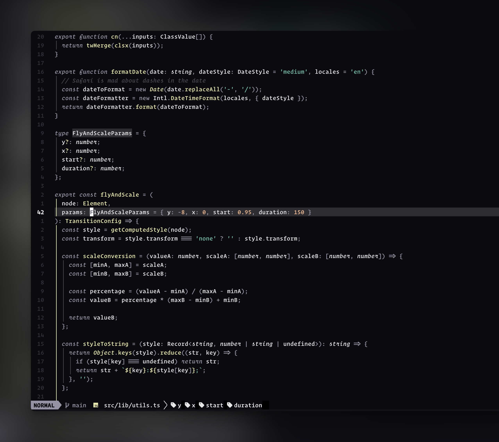

<h1 align="center" >🌑 oscura.nvim</h1>

<p align="center">Oscura - An unapologetically dark and minimal colorscheme for <a href="https://neovim.io/">NEOVIM</a> written in Lua</p>

<p align="center">Inspired by <a href="https://github.com/narative/oscura">Fey's Oscura theme</a>, featuring meticulously curated accent colors and precisely balanced contrast, crafting a sophisticated coding environment that's both elegant and easy on the eyes.</p>

<p align="center">
  
</p>

## ✔️ Requirements

- Neovim >= 0.9.2
- Treesitter (optional)

## #️ Supported Plugins

- [LSP](https://github.com/neovim/nvim-lspconfig)
- [Treesitter](https://github.com/nvim-treesitter/nvim-treesitter)
- [nvim-compe](https://github.com/hrsh7th/nvim-compe)
- [nvim-cmp](https://github.com/hrsh7th/nvim-cmp)
- [Telescope](https://github.com/nvim-telescope/telescope.nvim)
- [NvimTree](https://github.com/kyazdani42/nvim-tree.lua)
- [NeoTree](https://github.com/nvim-neo-tree/neo-tree.nvim)
- [BufferLine](https://github.com/akinsho/nvim-bufferline.lua)
- [Git Signs](https://github.com/lewis6991/gitsigns.nvim)
- [Lualine](https://github.com/hoob3rt/lualine.nvim)
- [LSPSaga](https://github.com/glepnir/lspsaga.nvim)
- [indent-blankline](https://github.com/lukas-reineke/indent-blankline.nvim)
- [nvim-ts-rainbow](https://github.com/p00f/nvim-ts-rainbow)
- [nvim-dap-ui](https://github.com/rcarriga/nvim-dap-ui)
- [Snacks](https://github.com/onur-ozkan/snacks.nvim) (Supports all UI components including Picker, Dashboard and Notifier)

## ⬇️ Installation

Install via package manager

```lua
-- Using Packer:
use 'webhooked/oscura.nvim'
```

```vim
" Using Vim-Plug:
Plug 'webhooked/oscura.nvim'
```

## 🚀 Usage

```lua
-- Lua:
vim.cmd[[colorscheme oscura]]

-- Or use the dusk variant (slightly lighter dark background):
vim.cmd[[colorscheme oscura-dusk]]
```

```vim
" Vim:
colorscheme oscura

" Or use the dusk variant (slightly lighter dark background):
colorscheme oscura-dusk
```

## 🎨 Features

Oscura features a carefully crafted dark color palette optimized for long coding sessions:

- Deep, dark background (`#0B0B0F`) that's easy on the eyes
- Alternate dusk variant with slightly lighter background (`#131419`)
- Clear syntax highlighting with muted yet distinctive colors
- Carefully chosen contrast levels to reduce eye strain
- Minimal visual noise with subtle UI elements

## ⚙️ Configuration

Oscura can be configured with a setup function:

```lua
require('oscura').setup({
  -- Enable italic comments
  italics = {
    comments = true, -- default: true
    keywords = true, -- default: true
  },
  -- Enable transparent background
  transparent_bg = false, -- default: false
  -- Show end-of-buffer ('~') characters
  show_end_of_buffer = false, -- default: false
  -- Override specific highlight groups
  overrides = {
    -- Override any highlight group
    Normal = { bg = "#000000" },
  },
})

-- Then set colorscheme
vim.cmd('colorscheme oscura')
```

### Lualine Support

If you are using [`lualine`](https://github.com/hoob3rt/lualine.nvim), you can enable the oscura theme:

```lua
require('lualine').setup {
  options = {
    -- ...
    theme = 'oscura' -- or 'oscura-dusk' for the dusk variant
    -- ...
  }
}
```

## 📝 License

[MIT License](LICENSE.md)
